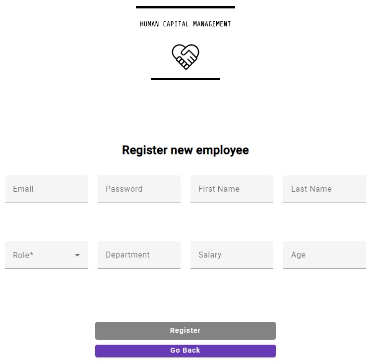
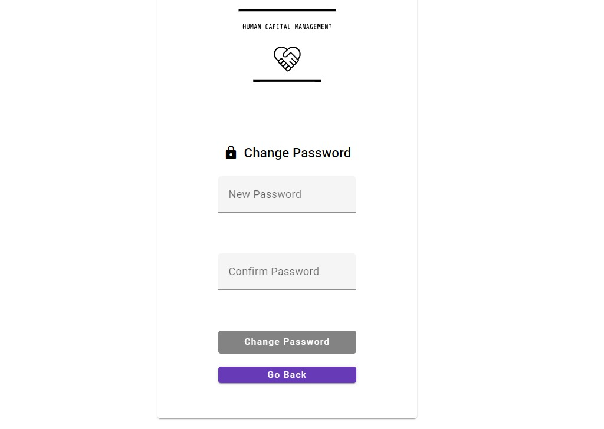
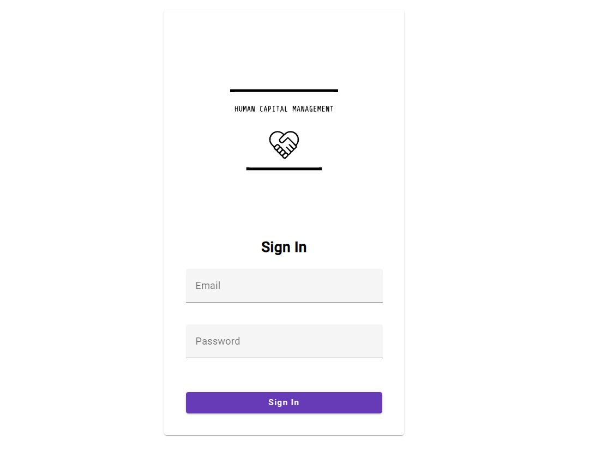
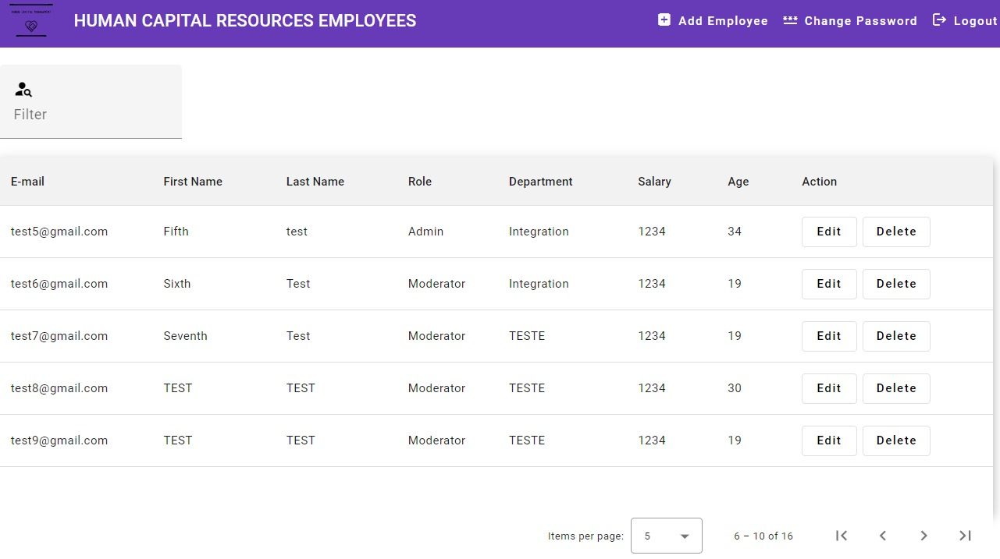

# Immedis_front_end_2023_hcm_Nikolay_Kostadinov

## What does the product do?

Human Capital Management is a comprehensive application designed to meet the needs of HR teams in small and medium-sized companies. With its user-friendly interface and powerful features, this app simplifies the management of people's records, salary information, and department details. It also incorporates a robust security module, ensuring controlled access for admins, moderators, and users.

## Who is using it?

Human Capital Management is suitable for small and medium-sized companies looking to streamline their HR processes. By centralizing employee records, salary information, and department details, the app saves time, reduces manual errors, and enhances overall productivity. With its security module, you can ensure that sensitive data remains protected and accessible only to authorized personnel.

## Used Technologies
*TypeScript*, *Angular*, *Angular Material*, *npm*, *scss*, *[json-server](https://github.com/typicode/json-server)*, *[json-server-auth](https://github.com/jeremyben/json-server-auth)*

## Folder Structure

```sh
./src
├── app
│   ├── app
│   │   ├── app.component.html
│   │   ├── app.component.scss
│   │   ├── app.component.spec
│   │   ├── app.component.ts
│   │   ├── app-routing.module.ts
│   │   └── app.module.ts
│   │
│   │
│   │── assets
│   │   ├── icons
│   │   │    └──logo.svg
│   │   │    └──changePassword.svg
│   │   │    └──listedEmployees.svg
│   │   │    └──loginPage.svg
│   │   │    └──register.svg
│   │   └── .gitkeep
│   │
│   │
│   ├── authentication
│   │   ├── sign-in
│   │   │    ├──sign-in.component.html
│   │   │    ├──sign-in.component.scss
│   │   │    ├──sign-in.component.spec.ts
│   │   │    └──sign-in.component.ts
│   │   ├── sign-up
│   │   │    ├──sign-up.component.html
│   │   │    ├──sign-up.component.scss
│   │   │    ├──sign-up.component.spec.ts
│   │   │    └──sign-up.component.ts
│   │   └── auth.module.ts
│   │
│   │
│   ├── employees
│   │   ├── change-password
│   │   │    ├──change-password.component.html
│   │   │    ├──change-password.component.scss
│   │   │    ├──change-password.component.spec.ts
│   │   │    └──change-password.component.ts
│   │   ├── employee-edit
│   │   │    ├──employee-edit.component.html
│   │   │    ├──employee-edit.component.scss
│   │   │    ├──employee-edit.component.spec.ts
│   │   │    └──employee-edit.component.ts
│   │   ├── employee-list
│   │   │    ├──employee-list.component.html
│   │   │    ├──employee-list.component.scss
│   │   │    ├──employee-list.component.spec.ts
│   │   │    └──employee-list.component.ts
│   │   ├── employees
│   │   │    ├──employees.component.html
│   │   │    ├──employees.component.scss
│   │   │    ├──employees.component.spec.ts
│   │   │    └──employees.component.ts
│   │   └── employee.module.ts
│   │
│   │
│   ├── shared
│   │   ├── helpers
│   │   │    └──constants.ts
│   │   │
│   │   ├── interceptors
│   │   │    └──auth.interceptor.ts
│   │   │
│   │   ├── models
│   │   │    └──roles.model.ts
│   │   │    └──user.model.ts
│   │   │    └──userdata.model.ts
│   │   │
│   │   ├── services
│   │   │    └──auth.service.ts
│   │   │    └──change-password.service.ts
│   │   │    └──employees.service.ts
│   │   │    └──local-storage.service.ts
│   │   │
```


## The core workflow and logic behind human capital resources
Admins are the most privileged individuals as they have the ability to add, delete, and edit other admins, moderators, and users. The workflow for adding a new user is as follows:

Firstly, an admin creates a new user, who is a new employee in the company.
The admin can create it from the register page:



Then, the new employee, depending on their role (admin, moderator, user), can immediately change their password.
The user can change its password from here:



Then, the user will be loged out and forced to login with his new password.
This is happening here:


Then, based on their permissions, they can then begin adding, editing, or filtering employees in the company.


## Authorization rules

- Admin **can add, remove and edit** moderators and users

- Moderators(and Admins) **can delete and edit** admins, moderators or users

- Moderators **cannot add** admins, moderators or users

- Users **can't delete, edit nor add** admins, moderators or users

- Users **can only** see the admins, moderators and the other users

## Additional Information
- The project's architecture is influenced by its classification as a small/medium enterprise, shaping its current design and structure. That's why for example the services are all in one folder `shared/services/...` instead of putting each service in each component on its own.

- The users information is stored in the db.json file, every user has a password: "test"

- The reason why lazy loading isn't performed on **EmployeeListComponent**, **SignUpComponent**, **ChangePasswordComponent** and **EmployeesComponent** is because of the implementation of **canMatch** guard in **EmployeesComponent**

- The **Email** control doesn't have validator because it already has from the json-server.